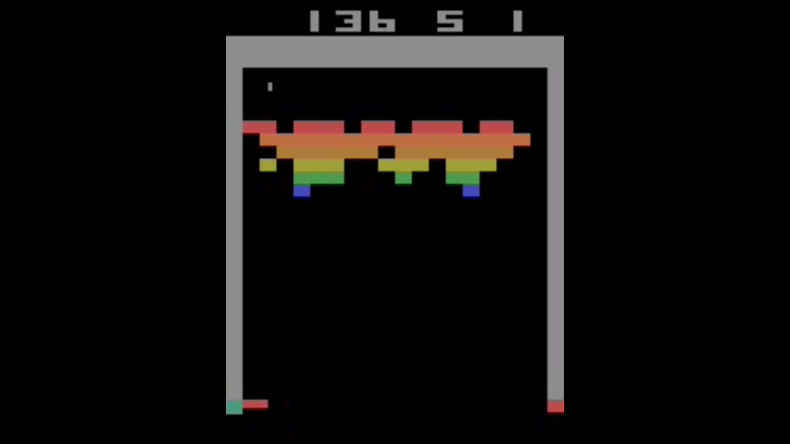
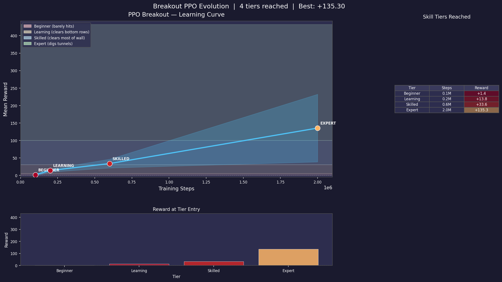
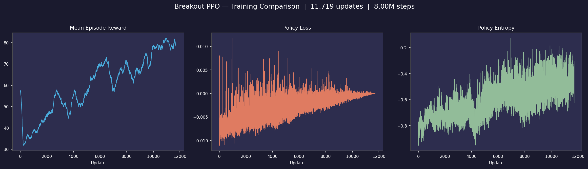

# Breakout PPO

A PPO agent that learns to play Atari Breakout (`BreakoutNoFrameskip-v4`) from
raw pixels with Stable-Baselines3, trained on an NVIDIA Jetson. It progresses
Beginner → Learning → Skilled → Expert (tunnel strategy) and reaches
**~390 raw score per full game — on par with the published RL-Zoo benchmark (398 ± 16)**.



*Expert-level play: the agent digs a tunnel through the wall (score 136 ≈ the +135/life expert tier).*

## Results
| Stage | Score |
|---|---|
| Per-life expert (tunnels) | +135 reward / life |
| **Full-game agent** (`best_model.zip`) | **~389.5 ± 21.5 raw / game** (benchmark ≈ 398) |

## Training
The agent learned from scratch to a per-life expert, then a full-game fine-tune
lifted it to benchmark level.



*Learning journey (per-life): tiers reached at 0.1M / 0.2M / 0.6M / 2.0M steps, best eval +135.*



*Full-game fine-tune (Run 4): mean episode reward, policy loss, and policy entropy over 8M steps.*

## Layout
- `config.py` — central config (env, PPO hyperparameters, tiers).
- `train.py` — training entry point (auto-resume, checkpointing).
- `callbacks.py` — `EvolutionCallback` (tier milestones) + `PruningCheckpointCallback`.
- `wrappers.py` — full-game env + `FireAfterLifeLoss` (serve the ball after each life).
- `play.py` — watch/record saved models (`--tier`, `--compare`, `--model`).
- `eval_raw.py` — raw full-game evaluation (benchmark-comparable).
- `visualize.py`, `make_overview.py` — training charts.
- `autostart_train.sh` + `breakout-train.service` — systemd auto-resume (Jetson reboots).
- `docs/` — convergence guide + run-by-run progress log.

Model weights, archived runs (`backups/`), logs, and videos are kept locally and
git-ignored (large binaries).

## Quick start
```bash
python3 train.py                          # train from scratch
python3 play.py --model models/best_model.zip   # watch the expert
python3 eval_raw.py models/best_model.zip 10     # raw full-game score
python3 visualize.py                      # regenerate training charts
```

## Repository
```bash
git clone https://github.com/agrau/breakout-ppo.git
```
The trained agent isn't committed (binaries are kept out of git). Download
**`best_model.zip`** from the
[v1.0 release](https://github.com/agrau/breakout-ppo/releases/tag/v1.0):
```bash
mkdir -p models && curl -L -o models/best_model.zip \
  https://github.com/agrau/breakout-ppo/releases/download/v1.0/best_model.zip
```
Archived runs (`backups/`), logs, and videos are also git-ignored (kept locally).

## Key lesson
Two runs were stuck at reward ~30 because the env (`ALE/Breakout-v5`) had an
effective **frameskip of 16** (its built-in 4 × the wrapper's 4) plus **0.25
sticky actions**. Switching to `BreakoutNoFrameskip-v4` (clean frameskip 4, no
sticky) unblocked learning; the agent then reached expert in ~2M steps, and a
full-game fine-tune reached the benchmark. See `docs/training_progress_log.txt`.
